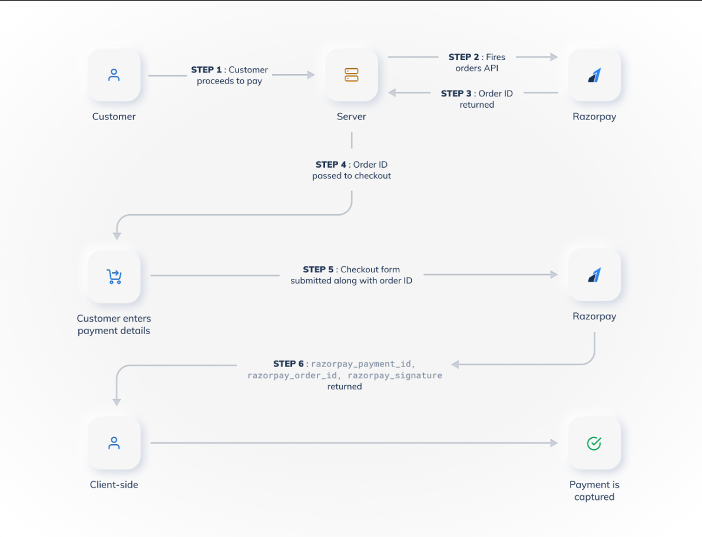

https://razorpay.com/docs/build/browser/assets/images/payment-flow-pg.jpg

# Payment Service

The `payment_service` is responsible for handling payment-related operations such as creating payment orders, generating payment links, and verifying payment signatures. It integrates with Razorpay to provide seamless payment processing.

## Features

- Integration with Razorpay for payment processing.
- Create payment orders and links.
- Verify payment signatures for secure transactions.
- Logging and error handling for payment operations.

## Installation

1. Clone the repository:
   ```bash
   git clone <repository-url>
   cd payment_service
   ```

2. Create a virtual environment:
   ```bash
   python -m venv venv
   source venv/bin/activate  # On Windows use `venv\Scripts\activate`
   ```

3. Install dependencies:
   ```bash
   pip install -r requirements.txt
   ```

4. Set up environment variables:
   - Copy `.env.backup` to `.env` and update the values as needed:
     ```dotenv
     RAZORPAY_KEY_ID=your-razorpay-key-id
     RAZORPAY_KEY_SECRET=your-razorpay-key-secret
     PAYMENT_LINK_CALLBACK_URL=https://your-callback-url.com
     ```

5. Apply database migrations:
   ```bash
   python manage.py makemigrations
   python manage.py migrate
   ```

6. Run the application:
   ```bash
   python manage.py runserver 8003
   ```

## Swagger Documentation
- The API documentation is available at `http://localhost:8003/swagger/` after running the server.

## Notification to order service
- The payment service will send a notification to the order service upon successful & failed payment. This is done using a POST request to the order service's endpoint with the payment details.

Start payment service polling sqs:
```bash
  python manage.py poll_sqs
```

## API Endpoints

### Payment Operations
- `POST /api/payments/create-order/` - Create a Razorpay order.
- `POST /api/payments/create-payment-link/` - Generate a Razorpay payment link.
- `POST /api/payments/verify-signature/` - Verify Razorpay payment signature.


## Technologies Used

- **Framework**: Django, Django REST Framework
- **Payment Gateway**: Razorpay
- **Database**: SQLite (default, can be replaced with PostgreSQL or MySQL)
- **Environment Management**: `python-dotenv`
- **Logging**: Python `logging` module
- **AWS SQS**: For message queuing and notification to the order service.

## License

This project is licensed under the MIT License. See the `LICENSE` file for details.
```